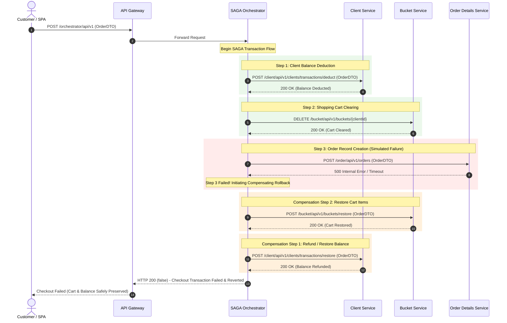
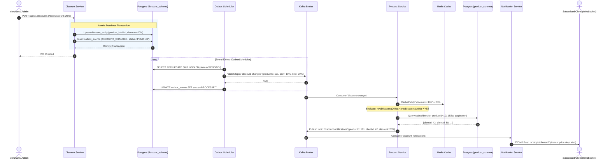
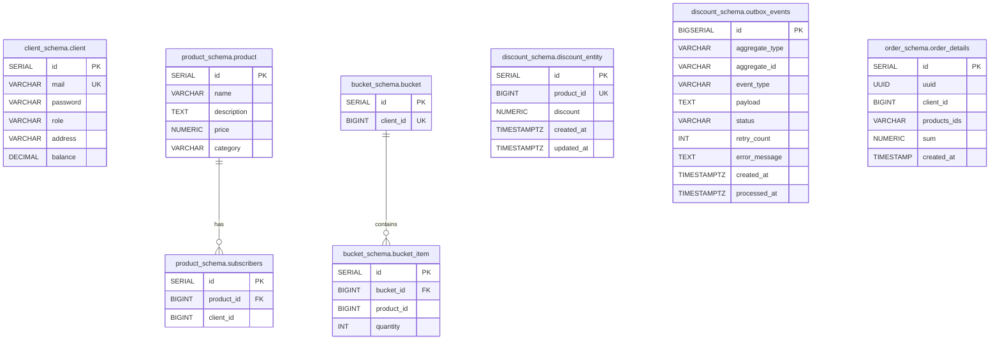

# Microservices System Architecture Specification

## 1. System Overview & Executive Summary

The platform is a distributed, event-driven e-commerce platform engineered with Spring Boot 3, Spring Cloud, Netflix Eureka, PostgreSQL (schema-per-service isolation), Redis caching, Apache Kafka event streaming, STOMP WebSockets, and Distributed Tracing via OpenZipkin.

```mermaid
graph TD
    subgraph Clients["Clients & Presentation Tier"]
        SPA["Web / Mobile Single Page App"]
        WSClient["WebSocket STOMP Client"]
    end

    subgraph Edge["Edge / Ingress Layer"]
        GW["API Gateway (Port 9000)<br/>Spring Cloud Gateway + Eureka Locator"]
        Eureka["Eureka Discovery Server (Port 8761)"]
    end

    subgraph CoreServices["Microservices Ecosystem"]
        ClientSvc["Client Service (Port 7015)<br/>Auth, JWT, Profile & Balance"]
        ProductSvc["Product Service (Port 7022)<br/>Catalog, Search & Subscriptions"]
        BucketSvc["Bucket Service (Port 7001)<br/>Cart & Product Aggregator"]
        DiscountSvc["Discount Service (Port 7005)<br/>Discounts & Transactional Outbox"]
        OrderSvc["Order Details Service (Port 7003)<br/>Order Persistence & History"]
        SagaOrch["SAGA Orchestrator (Port 7018)<br/>Checkout Coordinator + Resilience4j"]
        NotifSvc["Notification Service (Port 7099)<br/>Kafka Consumer & WebSocket Push"]
    end

    subgraph Storage["Data & Middleware Tier"]
        PG[("PostgreSQL 15 (Port 5419/5432)<br/>Schemas: client, product, bucket, discount, order")]
        Redis[("Redis 7 (Port 6379)<br/>Discounts Cache")]
        Kafka{{"Apache Kafka<br/>Topics: discount-changes, discount-notifications"}}
        Zipkin["OpenZipkin (Port 9411)<br/>Distributed Tracing Engine"]
    end

    SPA -->|HTTP / REST| GW
    WSClient <-->|WSS / STOMP| GW

    GW <-->|Service Discovery| Eureka
    GW -->|/client/**| ClientSvc
    GW -->|/product/**| ProductSvc
    GW -->|/bucket/**| BucketSvc
    GW -->|/discount/**| DiscountSvc
    GW -->|/order/**| OrderSvc
    GW -->|/orchestrator/**| SagaOrch
    GW -->|/notificationservice/**| NotifSvc

    SagaOrch -->|1. Deduct / Restore Balance| ClientSvc
    SagaOrch -->|2. Clear / Restore Cart| BucketSvc
    SagaOrch -->|3. Create / Cancel Order| OrderSvc

    BucketSvc -->|Fetch Product Metadata| ProductSvc
    ProductSvc -.->|Fallback / Miss| DiscountSvc
    ProductSvc <-->|Cache Read/Write| Redis

    DiscountSvc -->|Outbox Poller -> discount-changes| Kafka
    Kafka -->|Consume discount-changes| ProductSvc
    ProductSvc -->|Publish discount-notifications| Kafka
    Kafka -->|Consume discount-notifications| NotifSvc
    NotifSvc -->|STOMP Push /topic/client/{id}| WSClient

    ClientSvc --- PG
    ProductSvc --- PG
    BucketSvc --- PG
    DiscountSvc --- PG
    OrderSvc --- PG

    ClientSvc -.->|Trace Spans| Zipkin
    ProductSvc -.->|Trace Spans| Zipkin
    BucketSvc -.->|Trace Spans| Zipkin
    DiscountSvc -.->|Trace Spans| Zipkin
    OrderSvc -.->|Trace Spans| Zipkin
    SagaOrch -.->|Trace Spans| Zipkin
    GW -.->|Trace Spans| Zipkin
```

---

## 2. Microservice Inventory & Responsibility Matrix

| Service | Port | Service ID | Database Schema / Store | Primary Responsibilities | Communication Protocols |
| :--- | :--- | :--- | :--- | :--- | :--- |
| **API Gateway** | `9000` | `GATEWAY` | N/A | Dynamic routing, unified ingress, Zipkin span observation, CORS | HTTP/REST, WebSocket |
| **Eureka Server** | `8761` | `EUREKA` | In-memory | Service registry, health heartbeats, instance lookup | HTTP |
| **Client Service** | `7015` | `client` | `client_schema` (`client`) | User registration, JWT auth token generation/validation, balance management, saga deduct/restore | HTTP/REST, JPA |
| **Product Service** | `7022` | `product` | `product_schema` (`product`, `subscribers`), Redis | Product catalog, multi-ID batch queries, discount subscription registry, price drop event evaluator | HTTP/REST, Kafka, Redis |
| **Bucket Service** | `7001` | `bucket` | `bucket_schema` (`bucket`, `bucket_item`) | Cart state management, product enrichment via ProductService, cart clearing & saga restoration | HTTP/REST, RestTemplate/RestClient |
| **Discount Service** | `7005` | `discount` | `discount_schema` (`discount_entity`, `outbox_events`) | Batch & single product discount management, Transactional Outbox pattern, scheduled Kafka publishing | HTTP/REST, Kafka, Outbox Scheduler |
| **Order Details Service** | `7003` | `order` | `order_schema` (`order_details`) | Order history querying, saga order creation & deletion | HTTP/REST, JPA |
| **SAGA Orchestrator** | `7018` | `orchestrator` | Stateless (In-Memory execution) | Distributed checkout transaction coordinator with Resilience4j retries & compensating rollback transactions | HTTP/REST, RestClient |
| **Notification Service** | `7099` | `notificationservice` | N/A | Kafka consumer for discount alerts, STOMP/WebSocket broker delivering client-targeted real-time push messages | Kafka, STOMP/WebSocket |

---

## 3. Distributed Transaction Architecture: SAGA Checkout Workflow

The platform leverages an **Orchestrated SAGA Pattern** with backward compensation to ensure eventual consistency across distributed database boundaries without two-phase locking (2PC).

### 3.1 SAGA Sequence: Forward Execution & Compensation Path



### 3.2 SAGA Step Execution Spec

```
Step Execution Order:
  [1] ClientBalanceStep.process()  --> Deduct Total Sum from Client Balance
  [2] BucketStep.process()         --> Clear Client Bucket
  [3] OrderStep.process()          --> Persist Order in order_details table

Compensating Rollback Order (Reverse of Completed Steps):
  [1] OrderStep.revert()           --> DELETE Order by UUID (if created)
  [2] BucketStep.revert()          --> Batch re-insert items into bucket_item
  [3] ClientBalanceStep.revert()   --> Refund Total Sum to Client Balance
```

---

## 4. Asynchronous Event-Driven Architecture: Real-Time Discount & Notification Pipeline

When a product discount changes in `DiscountService`, it triggers a decoupled reactive pipeline leveraging the **Transactional Outbox Pattern**, **Kafka Event Streams**, **Redis Caching**, and **STOMP WebSockets**.



---

## 5. Storage Architecture & Schema Isolation

All microservices connect to a single PostgreSQL instance (`product-postgres` / `micr-db`), maintaining strict domain isolation via dedicated schemas and Flyway migrations:



---

## 6. API Gateway Routing & Service Ingress Map

The Spring Cloud API Gateway acts as the single reverse-proxy entry point on port `9000`.

```
====================================================================================================
GATEWAY INGRESS TOPOLOGY (http://localhost:9000)
====================================================================================================

/product/** ------------> PRODUCT-SERVICE (7022)
  ├── GET    /api/v1/products                  [Paginated product catalog]
  ├── GET    /api/v1/products/{id}             [Product by ID + discount price]
  ├── POST   /api/v1/products/by-ids           [Batch query products by list of IDs]
  ├── GET    /api/v1/products/category/{cat}   [Filter products by Category]
  ├── GET    /api/v1/products/search           [Keyword search]
  ├── POST   /api/v1/products                  [Add new product]
  ├── PUT    /api/v1/products/{id}             [Update product]
  ├── DELETE /api/v1/products/{id}             [Delete product]
  └── POST   /api/v1/products/{id}/subscribe/{clientId} [Subscribe to discount notifications]

/client/** -------------> CLIENT-SERVICE (7015)
  ├── POST   /api/v1/clients/register          [Register new client]
  ├── POST   /api/v1/auth/login                [Authenticate & obtain JWT]
  ├── POST   /api/v1/auth/validate             [Validate JWT bearer token]
  ├── GET    /api/v1/clients/me                [Current authenticated client profile]
  ├── PATCH  /api/v1/clients/{id}/balance      [Update user balance]
  ├── PATCH  /api/v1/clients/me/address        [Update address]
  ├── POST   /api/v1/clients/transactions/deduct  [SAGA forward step]
  └── POST   /api/v1/clients/transactions/restore [SAGA compensation step]

/bucket/** -------------> BUCKET-SERVICE (7001)
  ├── GET    /api/v1/buckets/{clientId}        [Get cart with enriched product details]
  ├── POST   /api/v1/buckets/{clientId}/products/{productId} [Add product to cart]
  ├── DELETE /api/v1/buckets/{clientId}/products/{productId} [Remove product from cart]
  ├── DELETE /api/v1/buckets/{clientId}        [Clear cart / SAGA forward step]
  └── POST   /api/v1/buckets/restore           [SAGA compensation step]

/discount/** -----------> DISCOUNT-SERVICE (7005)
  ├── GET    /api/v1/discounts                 [Get all discounts]
  ├── GET    /api/v1/discounts/paged           [Paginated discounts]
  ├── GET    /api/v1/discounts/{productId}     [Get discount by product ID]
  ├── POST   /api/v1/discounts                 [Batch upsert discounts + Outbox write]
  ├── PUT    /api/v1/discounts/{productId}     [Single product upsert + Outbox write]
  └── DELETE /api/v1/discounts/{productId}     [Delete discount]

/order/** --------------> ORDER-DETAILS-SERVICE (7003)
  ├── GET    /api/v1/orders/client/{id}        [Customer order history]
  ├── POST   /api/v1/orders                    [Create order record / SAGA forward step]
  └── DELETE /api/v1/orders/{uuid}             [Delete order / SAGA compensation step]

/orchestrator/** -------> SAGA-ORCHESTRATOR (7018)
  └── POST   /api/v1                           [Initiate distributed checkout SAGA]

/notificationservice/** > NOTIFICATION-SERVICE (7099)
  ├── WS     /ws                               [STOMP WebSocket handshake endpoint]
  └── TOPIC  /topic/client/{clientId}          [Personal push notification channel]
```

---

## 7. Resilience, Fault Tolerance & Observability

```mermaid
flowchart LR
    subgraph Observability["Distributed Tracing (OpenZipkin)"]
        Span[Span / Trace Propagation] -->|W3C / B3 Headers| Tracer[Zipkin Server (9411)]
    end

    subgraph FaultTolerance["Resilience4j Policies"]
        direction TB
        CB[CircuitBreaker: ProductSvc -> DiscountSvc]
        RetrySaga[Retry with Predicates: Saga Orchestrator]
        OutboxLock[Transactional Lock: Outbox SKIP LOCKED]
    end

    subgraph MessagingGuarantee["At-Least-Once Delivery"]
        OutboxDB[(Postgres Outbox)] -->|Scheduled Poll| KafkaProducer[Kafka Producer Sync]
        KafkaProducer -->|Idempotent Partitions| KafkaBroker[Kafka Cluster]
    end
```

- **Resilience4j Circuit Breakers & Retries**:
  - `ProductService` uses a `@CircuitBreaker` and `@Retry` on `DiscountCacheManager`. In case of `DiscountService` outages, it falls back gracefully to `0.0%` discount without failing catalog requests.
  - `SagaOrchestrator` decorates both process and revert operations with configurable `Retry` policies using custom `RetryResultPredicate` to handle transient network anomalies.
- **Transactional Outbox Pattern**:
  - Guarantees *at-least-once* publishing to Kafka from `DiscountService` without distributed 2PC transactions. Uses `SELECT FOR UPDATE SKIP LOCKED` to allow scalable parallel workers.
- **Distributed Tracing**:
  - Micrometer Tracing with 100% sample probability transmits `traceId` and `spanId` across HTTP headers and log formats (`[%15.15t] [%X{traceId:-},%X{spanId:-}]`) to OpenZipkin on port 9411.
